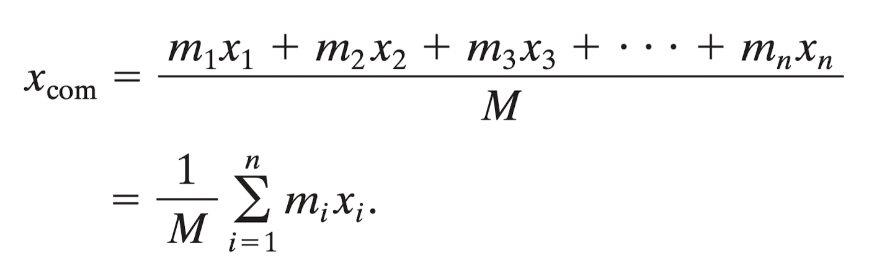
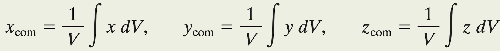

# Centro de Massa

## Centro de massa para 2 partículas:
  
- Sendo
    - X(com): posição, no eixo X, do centro de massa do sistema m1-m2
    - m1: massa do corpo 1
    - m2: massa do corpo 2
    - x1: posição, no eixo X, do corpo 1
    - x2: posição, no eixo X, do corpo 2

## Centro de massa para muitas partículas:
  
- Sendo
    - X(com): posição, no eixo X, do centro de massa do sistema m1-m2-m3...mn
    - m1: massa do corpo 1
    - m2: massa do corpo 2
    - m3: massa do corpo 3
    - mn: massa do corpo n
    - M: somatório de todas as massas do sistema considerado
    - x1: posição, no eixo X, do corpo 1
    - x2: posição, no eixo X, do corpo 2
    - x3: posição, no eixo X, do corpo 3
    - xn: posição, no eixo X, do corpo n

## Centro de massa no espaço de 3 dimensões, usando vetores:

- Representação de 1 vetor:

## Centro de massa de um corpo considerado como sólido de infinitos pontos
- Na vida real, as fórmulas anteriores representam aproximações pois em um sistema de muitos corpos sólidos diferentes, nunca temos a posição de cada massa do sistema.
- Logo, acabamos por errar quando multiplicamos a posição e a massa de cada corpo.
- Mas se o corpo for simétrico e se nós temos realmente o ponto central (centro de massa) de cada corpo, nossos calculos estariam certos.
- A solução para este cálculo imperfeito é o uso da ferramenta integral da matemática.
- Logo, somos mais precisos, com a fórmula:

- Esta é a única fórmula correta pois tratamos cada corpo como uma distribuição contínua de matéria e usamos a inregral para somar todas as possíveis posições das massas, com os respectivos valores das massas. 

## Centro de massa de um corpo pelo volume do corpo considerado sua densidade como uniforme
- Consideramos apenas corpos uniformes que possuem densidade uniforme. 
- A densidade se mantem por todo o corpo.
- Cada parte do corpo tem uma massa (dm) e também um volume (dV).
- Como consideramos que o corpo é uniforme no que se considera a sua densidade, podemos afirmar que, assim como a massa pode ser considerada como uma distribuição contímnua de pequenas unidades de massa, também podemos dizer que o volume total se apresenta como uma distribuição contínua de volume.
- Da mesma forma que fizemos para a característica massa, também podemos fazer para a característica volume:

