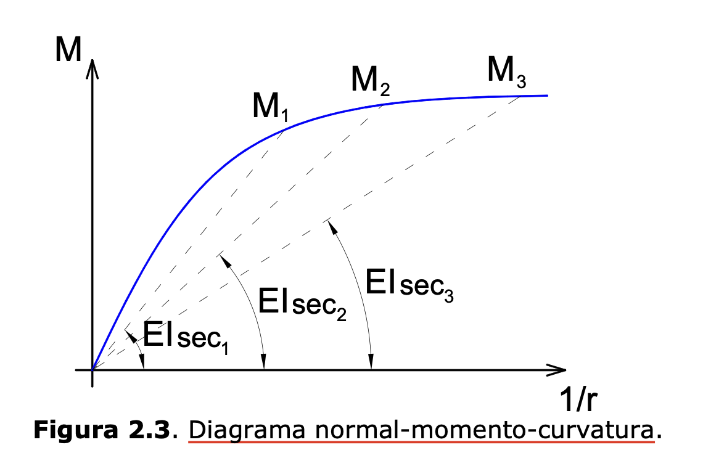

# Diagrama Normal-Momento-Curvatura
- No dia-a-dia da análise estrutural, o projetista baseia suas análise no diagrama normal-momento-curvatura e não no gráfico tensão-deformação. O foco do trabalho é normalmente a identificação de momentos fletores e não das tensões.

- O diagrama Normal-Momento-Curvatura é usado no cálculo de elementos submetidos a esforço normal:
    - Calculo de vigas submetidas à flexão composta
    - Calculo de pilares
    