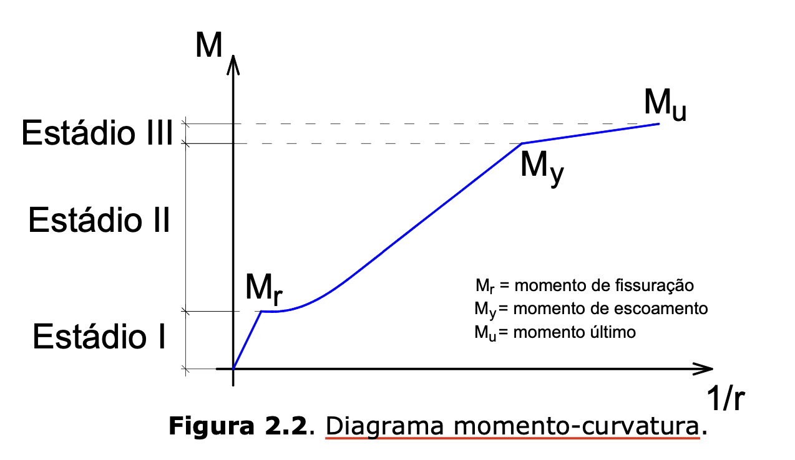

# Diagrama Momento-Curvatura
- No dia-a-dia da análise estrutural, o projetista baseia suas análise no diagrama momento-curvatura e não no gráfico tensão-deformação. O foco do trabalho é normalmente a identificação de momentos fletores e não das tensões.

- O Diagrama Momento-Curvatura é usado para:
    - Análise não linear de pavimentos.
    - Cálculo de flechas
- Com o gráfico Momento-Curvatura pode-se idenfificar a Rigidez (EI) dos elementos estruturais.